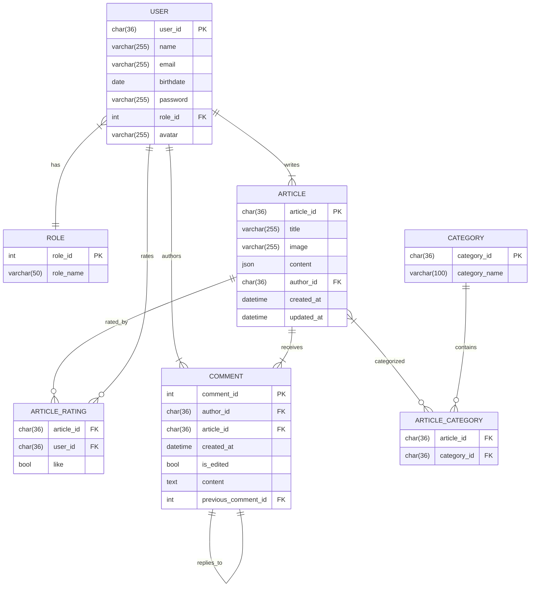

# Техническое задание
## Портал публикаций (статей) "insight"
### Описание
Целью проекта является разработка веб-приложения для публикации и работы со статьями с функциями CRUD для контента и комментариев, пользовательскими профилями, а также удобными фильтрами.
### Функциональные требования
#### Роли
- Пользователь: может создавать статьи, редактировать их, читать статьи других пользователей портала, оценивать статью и оставлять комментарии.
- Администратор: обладает всеми правами пользователями + имеет возможность удалять комментарии и статьи других пользователей.
#### Главная страница
Главная страница включает в себя:
- поиск статей по их имени, категории и автору
- фильтрацию статей по категориям, дате создания, обновления и оценке
- сортировка статей по дате создания, обновления, оценке
- лента последних статей на портале
#### Создание статьи
При создании статьи должна быть реализована технология WYSIWYG (What You See Is What You Get) — визуальный редактор, в котором пользователь создает и редактирует контент прямо в форме, максимально близкой к тому, как этот контент будет выглядеть на выходе. У статьи обязательно есть заголовок и главная картинка. Так же будет дан выбор категорий статьи.
#### Редактирование статьи
Функционал похож с созданием статьи, только после обновления у статьи появится атрибут "последнее обновление", что пользователи видели, что статья была изменена. Статью можно удалить. 
#### Страница статьи
Страница статьи включает в себя:
- название статьи
- главная картинка (обложка)
- имя и аватар автора статьи
- время создания и последнего обновления
- контент статьи
- категории статьи
- оценки статьи
- комментарии к статье
#### Комментарии к статье
- имя и аватар автора комментария
- дата создания
- контент комментария (только текст)
- отметка об изменении
- комментарии к комментария
#### Профиль пользователя
Страница пользователя включает в себя:
- данные пользователя (имя, почту (видна самому пользователю), картинку, дату рождения)
- статьи пользователя + статистика по ним, которая включает в себя оценки 
### Технологический требования
- База данных: MySQL
- Back: PHP (Symfony)
- Front: React (+ editor.js)
### ER-диаграмма
